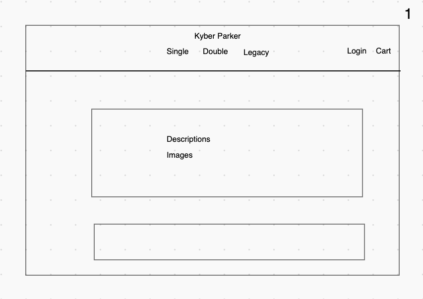
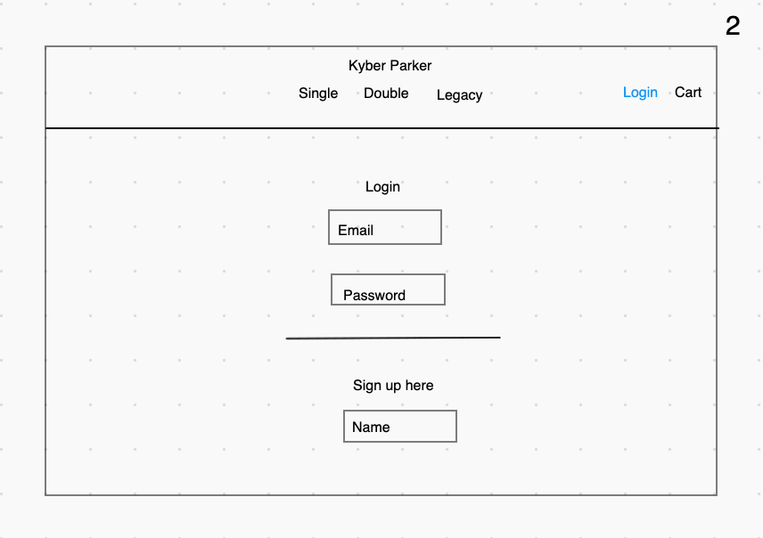
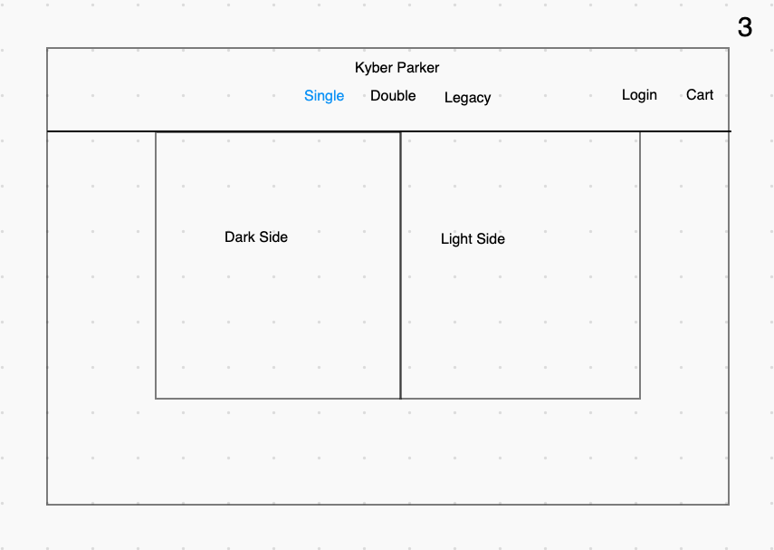
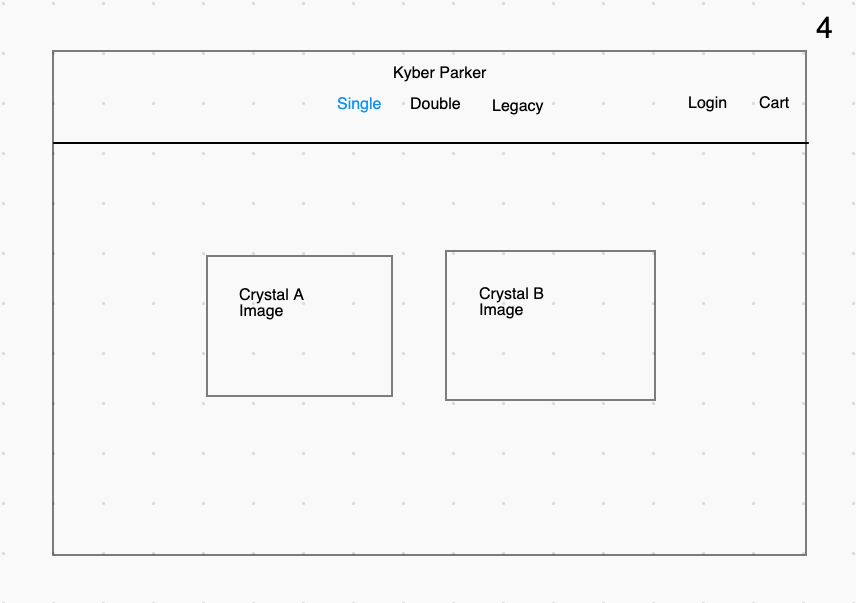
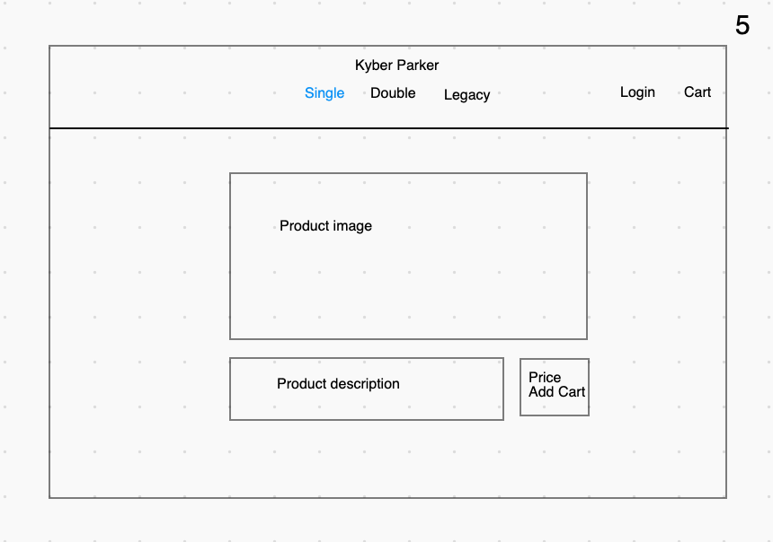
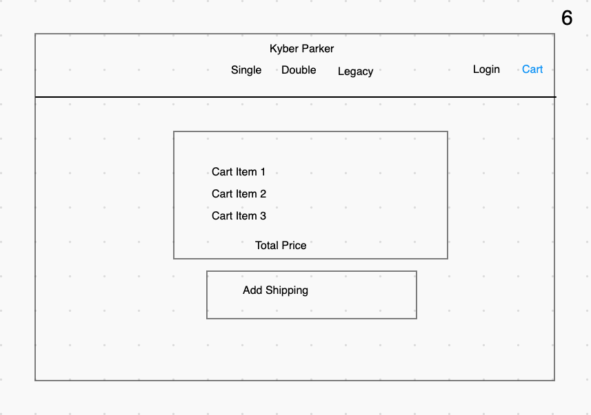
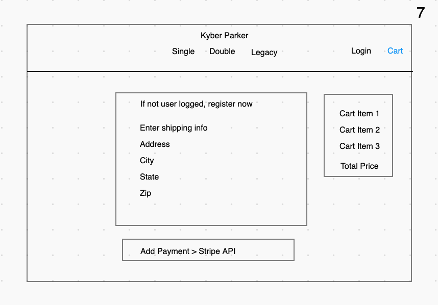
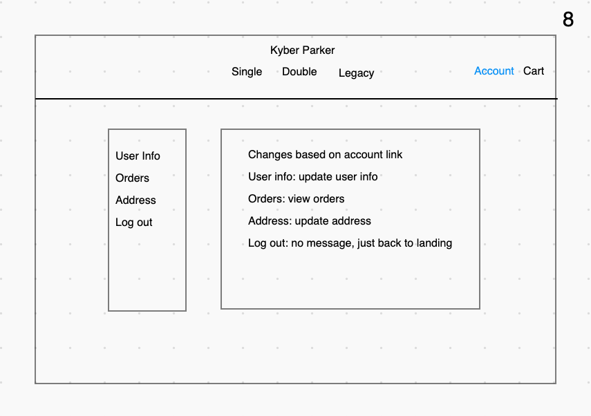
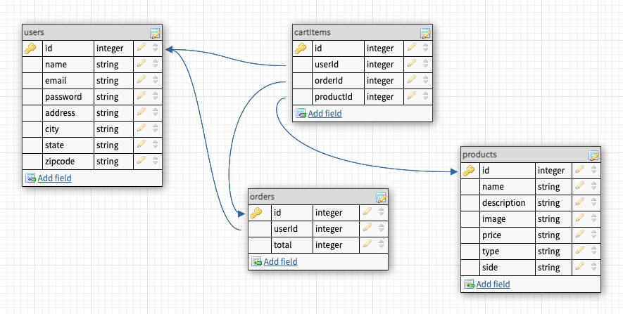

# Kyber Parker

## Overview
Kyber Parker is a boutique, direct-to-consumer company that sells reclaimed kyber crystals to force wielders looking to craft a high-quality lightsaber.

Underneath the hood, Kyber Parker is an e-commerce, full stack web application with a Javascript/React frontend and a Python/Flask backend. Users visiting Kyber Parker will be able to browse the inventory, select products to purchase, create an account, review their shopping cart, and ultimately complete an order.

Inspirations include Star Wars, AllBirds, Casper, and Warby Parker.

## Technologies Used
* Javascript
* HTML
* CSS
* React
* Python
* Flask
* PostgreSQL
* Stripe API

## Completion Timeline
* 5/21: frontend setup, backend setup, heroku deployed
* 5/24: frontend mvp, backend 90% done
* 5/27: frontend done, backend done

## Expected Challenges
* Stripe API integration with Flask backend
* Managing JS and Python in same project

## Wireframes
#### 1. Landing

#### 2. Login / Register

#### 3. Force Side Affinity

#### 4. Product Catalog

#### 5. Single Product Details

#### 6. Shopping Cart

#### 7. Shipping and Billing

#### 8. Account

## User Stories
1. When I load Kyber Parker for the first time, I am able to see a landing page with descriptions about the site and products.
2. When I load Kyber Parker without being logged in, I can browse products and product details.
3. When I load Kyber Parker without being logged in, my navbar displays product types, login, create account.
4. When I register for the first time, I enter my name, email, and password.
5. When I login, I will need to enter my email and password.
6. When I finish logging in, I will see the landing page with descriptions about the side and products.
7. When I finish logging in, my navbar displays product types, account, shopping cart.
8. When I select a product based on its type (single, double, legacy), I have the option to choose between its force side affinity (light or dark).
9. When I view a single product, I can see the name, description, type, force side affinity, image, price, and add to cart option.
10. When I add a product to my cart, I can see the item in my shopping cart.
11. When I select add shipping, I can enter my shipping address.
12. When I select add shipping without being logged in, I have to make an account before proceeding.
13. When I select add payment, I can enter my billing information.
14. When I select complete checkout, I can review my order in my account.
15. When I select my account, I can review my orders, my user information, my addressed, and I can logout.

## Frontend Component Diagram
TBD

## Backend Entity Relationship Diagram

## Routes Inventory
Updating..

| Verb | Path | Route Summary |
| --- | --- | --- |
| `GET` | `/users/verify` | Verify user |
| `POST` | `/users/register` | Register new user |
| `POST` | `/users/login` | Login existing user |

## MVP Checklist
1. [ ] Build react frontend with minimal HTML & CSS
2. [ ] Build flask backend with routes and Postgres database
3. [ ] Build user authentication
4. [ ] Able to view all products
5. [ ] Able to view single product details
6. [ ] Able to add/remove items to/from cart and view current cart items
7. [ ] Able to submit an order of products and view all past orders
8. [ ] Able to view single order details

## Stretch Goals
1. [ ] Mobile/responsive design
2. [ ] Customer Support Messaging
3. [ ] Customer Loyalty Program: Force Points, Visualization, Credit on Orders
